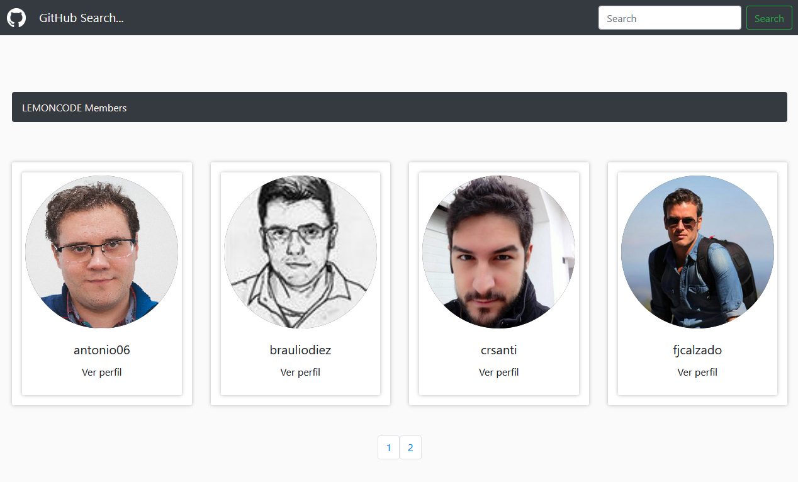
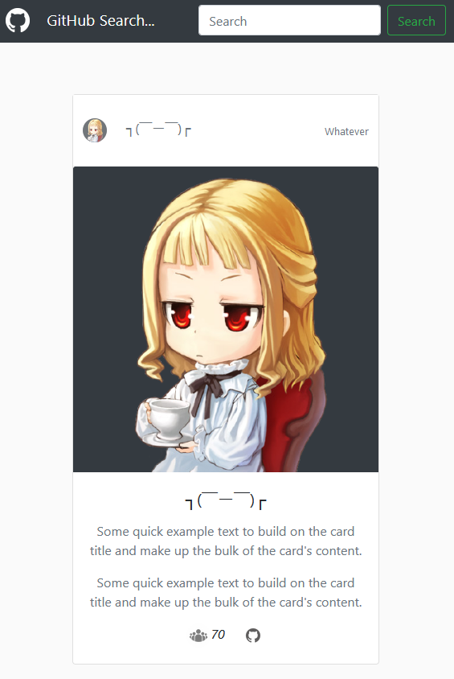

# 7 Angular Lab. GitHub Searcher

El ejercicio consiste en extender el ejemplo de mostrar los miembros de una organización que pertenece a Github.

En el [ejemplo de partida](https://github.com/Lemoncode/angular-exercise/tree/master/00_start_8) está harcodeado "Lemoncode", lo que queremos es que el usuario pueda teclear cualquier organización (por ejemplo "Microsoft") y al pulsar en un botón se muestra la lista de miembros que pertenece a dicha compañia.

- Se amplia con lo siguiente:

- Para el diseño se ha utilizado bootstrap.

- Se ha añadido funcionalidad al pulsar enter para la búsqueda.

- Se ha añadido un spinner de carga con la librería ngx.

- La aplicación muestra un error si la búsquena no se puede completar.

- Se ha añadido una paginación básica.

## Capturas de la aplicación

### Index

### Página de miembros de la organización

### Página de perfil individual

